# Robustness of Implicit Q-Learning Under Controlled Distribution Shift

**CMPE 260 — Reinforcement Learning | Group 6 | San José State University**

> 📖 **New to this project?** Read the [Experiment Guide](docs/EXPERIMENT_GUIDE.md) for a plain-language explanation of the entire experiment — what IQL is, what MuJoCo robots are, what the distribution shifts do, and how to interpret the results.

---

## Author Contributions

- **Pramod Yadav:** Literature survey, evaluation metrics implementation, HPC seed runs, result analysis, partial report writing, and manuscript review.
- **Uday Arora:** TripleCritic (Q-ensemble) implementation, robustness metric design (AUDC), ablation experiments, partial report writing, and manuscript review.
- **Shloak Aggarwal:** Distribution shift wrapper design, evaluation pipeline, project coordination, and manuscript review.
- **Joao Lucas Veras:** IQL baseline reproduction, codebase integration, baseline experiments, and manuscript review.

---

## TL;DR

We trained IQL (Implicit Q-Learning) agents on three D4RL MuJoCo locomotion tasks and systematically measured how their performance degrades under four types of environment perturbation — gravity scaling, friction scaling, observation noise, and reward perturbation — applied only at test time. We extended IQL's standard 2-critic architecture to a 3-critic ensemble (TripleCritic) and ablated the expectile hyperparameter τ ∈ {0.5, 0.7, 0.8, 0.9}, producing **1,536 shift-level evaluations** across 4 seeds. The key finding: **3Q consistently improves robustness on Hopper** (gravity AUDC 0.529 vs 0.616), but the benefit is environment-dependent — Walker2d favors 2Q, and HalfCheetah shows no significant difference. Lower τ trades baseline performance for better robustness, while higher τ (0.8–0.9) increases both performance and cross-seed variance. No single (critics, τ) configuration dominates across all environments and shift types.

---

## What We Set Out To Do

From our proposal, we planned to:

1. Review offline RL literature (IQL, CQL, TD3+BC)
2. Reproduce IQL on D4RL benchmarks and establish baseline scores
3. Design controlled distribution shifts in MuJoCo (gravity, friction, observation noise, reward perturbations)
4. Evaluate robustness across multiple seeds
5. Implement a robustness-oriented extension (Q-ensemble with 3 critics)
6. Conduct ablation studies comparing DoubleCritic vs TripleCritic under shift

The core research question: *How robust is Implicit Q-Learning under controlled distribution shift, and can we improve its robustness?*

---

## What We Have Demonstrated

### Literature & Theory
- Surveyed three offline RL approaches: IQL (expectile regression), CQL (pessimistic Q-values), TD3+BC (behavior cloning regularization)
- Defined formal robustness metrics: normalized performance `J(π, E_δ)`, robustness drop `Δ(δ)`, and Area Under Degradation Curve (AUDC)
- Identified the gap: none of these methods have been evaluated under environment-level perturbations at test time

### Baseline Reproduction
- Trained IQL (2Q) on all 3 D4RL medium datasets with 4 seeds: hopper (1571 ± 136), halfcheetah (5543 ± 31), walker2d (3360 ± 152)
- Implementation uses JAX/Flax with 2-layer MLPs (256 hidden units), expectile τ=0.7, temperature β=3.0

### Q-Ensemble Extension
- Implemented `TripleCritic` — 3 Q-networks taking `min(q1, q2, q3)` for more conservative value estimation
- Trained on all 3 environments with 4 seeds: hopper (1469 ± 38), halfcheetah (5501 ± 35), walker2d (3423 ± 104)
- 3Q improves robustness on Hopper (lower AUDC across all 4 shifts) but the effect is environment-dependent

### Distribution Shift Evaluation
- Evaluated 8 configurations (2Q/3Q × τ ∈ {0.5, 0.7, 0.8, 0.9}) across 3 datasets and 4 shift types
- **Total: 1,536 shift-level evaluations** (3 envs × 8 configs × 4 shifts × 4 levels × 4 seeds), each averaged over 10 episodes
- Gravity and friction are the most damaging shifts (AUDC > 0.5); reward perturbation has negligible impact

### Expectile τ Ablation
- Ablated τ ∈ {0.5, 0.7, 0.8, 0.9} on all 3 environments with both 2Q and 3Q
- Clear trend: lower τ → lower baseline but better robustness (more pessimistic value estimates)

### Evaluation Pipeline
- `scripts/evaluate_shift.py` — evaluates a trained agent under any combination of shift types, outputs CSV
- `scripts/compute_robustness.py` — reads CSVs and computes Δ(δ), AUDC, worst-case performance, writes summary CSVs
- `scripts/run_all_hpc.sh` — single script that runs all training, evaluation, ablation, and analysis on SLURM

---

## Experiment Status

| Task | Status | Notes |
|---|---|---|
| Baseline training (2Q) on all 3 envs | ✅ Complete | 300k steps, 4 seeds |
| Q-ensemble training (3Q) on all 3 envs | ✅ Complete | 300k steps, 4 seeds |
| Shift evaluation (2Q + 3Q × 4 shifts × 4 levels) | ✅ Complete | 24 CSVs (6 per seed × 4 seeds) |
| Expectile τ ablation (τ = 0.5, 0.8, 0.9, 2Q + 3Q) | ✅ Complete | 72 CSVs (18 per seed × 4 seeds) |
| Multiple seeds (42, 43, 44, 45) | ✅ Complete | Error bars in all results |
| Robustness metrics (AUDC mean ± std) | ✅ Complete | 3 summary CSVs with multi-seed stats |
| Final results table and plots | ✅ Complete | Mermaid charts below |

---

## Datasets

We use the [D4RL](https://github.com/Farama-Foundation/d4rl) benchmark datasets for MuJoCo continuous control:

| Environment | Obs Dim | Act Dim | Dataset Size | Description |
|---|---|---|---|---|
| `hopper-medium-v2` | 11 | 3 | 1M transitions | One-legged hopping robot, partially-trained policy data |
| `halfcheetah-medium-v2` | 17 | 6 | 1M transitions | Two-legged running robot, partially-trained policy data |
| `walker2d-medium-v2` | 17 | 6 | 1M transitions | Two-legged walking robot, partially-trained policy data |

---

## Methodology

### Training
Standard IQL with expectile regression for value learning, TD updates for Q-learning, and advantage-weighted behavioral cloning for policy extraction. Two-layer MLP networks (256 hidden units), Adam optimizer, cosine learning rate schedule for the actor.

### Distribution Shift
Perturbations are applied **at evaluation time only** — the policy is never retrained. This isolates the sensitivity of offline-trained policies to changes in environment dynamics.

| Shift Type | MuJoCo Parameter | Levels | What It Tests |
|---|---|---|---|
| Gravity | `model.opt.gravity` | 0.5×, 1.0×, 1.5×, 2.0× | Robustness to physics/dynamics changes |
| Observation Noise | Gaussian σ | 0.0, 0.01, 0.1, 0.3 | Robustness to sensor noise (perception) |
| Friction | `model.geom_friction` | 0.5×, 1.0×, 1.5×, 2.0× | Robustness to contact dynamics changes |
| Reward Perturbation | Gaussian σ | 0.0, 0.1, 0.5, 1.0 | **Control experiment** — verifies the policy is truly offline (no test-time adaptation) |

> **Note on Reward Perturbation:** Since IQL is an offline algorithm, the policy is frozen after training and never updates from rewards during evaluation. Reward perturbation therefore has near-zero impact on agent behavior (AUDC < 0.003 across all configs). This serves as a sanity check: if reward perturbation showed large degradation, it would indicate the agent is incorrectly adapting at test time.

### Q-Ensemble Extension
We extend IQL's `DoubleCritic` (2 Q-networks, `min(q1,q2)`) to a `TripleCritic` (3 Q-networks, `min(q1,q2,q3)`). The hypothesis: taking the minimum over more Q-networks produces more conservative value estimates, which should degrade less under distribution shift.

### Metrics
- **Robustness drop:** `Δ(δ) = (J(π, E_0) - J(π, E_δ)) / J(π, E_0)` — 0 means robust, positive means degraded
- **AUDC:** Area Under Degradation Curve — integrates |Δ(δ)| over shift levels. Lower is better.
- **Worst-case:** minimum score across all shift levels

### Evaluation Strategy

The experiment pipeline runs in 4 phases, each building on the previous:

1. **Phase 1 — Training:** Train IQL agents for each (environment, num_critics) pair at the default expectile τ=0.7. This produces 6 trained models (3 envs × 2Q/3Q). Each model is saved as a checkpoint.

2. **Phase 2 — Shift Evaluation:** Load each checkpoint and evaluate it under all 4 shift types at 4 severity levels (16 conditions per model). The baseline-level rows (gravity=1.0, noise=0.0, etc.) in these CSVs serve as the **no-shift baseline performance** — no separate baseline evaluation is needed. This produces 6 CSVs with the 2Q vs 3Q comparison.

3. **Phase 3 — τ Ablation:** For each non-default τ ∈ {0.5, 0.8, 0.9}, retrain from scratch and re-evaluate under all shifts. This is done for both 2Q and 3Q, producing 18 additional CSVs (3 envs × 3 τ values × 2 critic configs). Combined with the τ=0.7 results from Phase 2, this gives a complete 4-point τ sweep for each (environment, critic) pair.

4. **Phase 4 — Analysis:** Compute AUDC and worst-case metrics from all CSVs, write per-environment summary files (`summary_{env}.csv`) with one row per (config, shift_type) combination.

The key design choice is that **shift evaluation inherently includes baseline measurement** — the no-shift condition is just one of the 4 levels tested. This avoids redundant evaluation runs and ensures baseline and shifted results use the exact same trained model.

---

## Results

All experiments run on SJSU CoE HPC (GPU partition), 300k training steps, **4 seeds (42, 43, 44, 45)**. The experiment covers **3 D4RL datasets × 8 configurations × 4 shift types × 4 levels × 4 seeds = 1,536 shift-level evaluations**, each averaged over 10 episodes. All AUDC values below are reported as **mean ± std** across seeds.

> 📊 **Per-seed breakdown:** See [Detailed Results](docs/DETAILED_RESULTS.md) for individual seed values, cross-environment comparison tables, and seed stability analysis.

### Baseline Performance (No Shift, τ=0.7, mean ± std)

| Environment | 2Q Return | 3Q Return |
|---|---|---|
| hopper-medium-v2 | **1571 ± 136** | 1469 ± 38 |
| halfcheetah-medium-v2 | **5543 ± 31** | 5501 ± 35 |
| walker2d-medium-v2 | 3360 ± 152 | **3423 ± 104** |

### 2Q vs 3Q Robustness (AUDC mean ± std — lower is better)

**Hopper** — 3Q more robust on gravity and friction:

| Shift Type | 2Q AUDC | 3Q AUDC | Winner |
|---|---|---|---|
| Gravity | 0.616 ± 0.027 | **0.529 ± 0.069** | 3Q |
| Obs Noise | 0.134 ± 0.020 | **0.126 ± 0.017** | 3Q |
| Friction | 0.713 ± 0.026 | **0.692 ± 0.011** | 3Q |
| Reward Perturb | 0.002 ± 0.001 | **0.001 ± 0.000** | 3Q |

**HalfCheetah** — Nearly identical (within error bars):

| Shift Type | 2Q AUDC | 3Q AUDC | Winner |
|---|---|---|---|
| Gravity | **0.255 ± 0.021** | 0.258 ± 0.004 | ~Tie |
| Obs Noise | 0.142 ± 0.003 | **0.135 ± 0.005** | 3Q |
| Friction | **0.016 ± 0.003** | 0.018 ± 0.007 | ~Tie |
| Reward Perturb | 0.001 ± 0.001 | 0.001 ± 0.000 | Tie |

**Walker2d** — 3Q slightly better on noise, 2Q on gravity:

| Shift Type | 2Q AUDC | 3Q AUDC | Winner |
|---|---|---|---|
| Gravity | **0.716 ± 0.024** | 0.739 ± 0.038 | 2Q |
| Obs Noise | 0.122 ± 0.010 | **0.107 ± 0.019** | 3Q |
| Friction | **0.109 ± 0.045** | 0.131 ± 0.017 | 2Q |
| Reward Perturb | **0.001 ± 0.000** | 0.001 ± 0.001 | Tie |

#### 2Q vs 3Q Gravity AUDC Across Environments

```mermaid
xychart-beta
    title "Gravity AUDC by Environment (τ=0.7, lower is better)"
    x-axis ["Hopper", "HalfCheetah", "Walker2d"]
    y-axis "AUDC" 0 --> 0.8
    bar [0.616, 0.255, 0.716]
    bar [0.529, 0.258, 0.739]
```



> **Legend:** First bar = 2Q, Second bar = 3Q. On Hopper, 3Q reduces gravity AUDC by 14%. On HalfCheetah, 2Q and 3Q are within error bars. On Walker2d, 2Q is slightly more robust.

### Expectile τ Ablation (2Q + 3Q, mean ± std across 4 seeds)

We ablated the expectile hyperparameter τ ∈ {0.5, 0.7, 0.8, 0.9} for both 2Q and 3Q across all 3 environments and all 4 shift types. The default τ=0.7 results come from the Phase 2 shift evaluation; the non-default τ values were trained and evaluated separately in Phase 3. This gives a complete 4×2 grid (4 τ values × 2 critic configs) per environment.

**Hopper — AUDC by τ (lower = more robust):**

| τ | Config | Baseline | Gravity | Obs Noise | Friction |
|---|---|---|---|---|---|
| 0.5 | 2Q | 1529 ± 109 | **0.538 ± 0.086** | **0.113 ± 0.015** | 0.696 ± 0.022 |
| 0.5 | 3Q | 1627 ± 117 | 0.573 ± 0.069 | 0.131 ± 0.027 | 0.717 ± 0.019 |
| 0.7 | 2Q | 1571 ± 136 | 0.616 ± 0.027 | 0.134 ± 0.020 | 0.713 ± 0.026 |
| 0.7 | 3Q | 1469 ± 38 | 0.529 ± 0.069 | 0.126 ± 0.017 | **0.692 ± 0.011** |
| 0.8 | 2Q | 1899 ± 228 | 0.730 ± 0.031 | 0.158 ± 0.018 | 0.764 ± 0.028 |
| 0.8 | 3Q | 1741 ± 37 | 0.694 ± 0.027 | 0.145 ± 0.001 | 0.742 ± 0.006 |
| 0.9 | 2Q | 1928 ± 291 | 0.687 ± 0.097 | 0.163 ± 0.014 | 0.759 ± 0.041 |
| 0.9 | 3Q | 1848 ± 165 | 0.738 ± 0.020 | 0.158 ± 0.019 | 0.754 ± 0.024 |

> **Hopper summary:** 3Q at τ=0.7 achieves the best gravity AUDC (0.529 ± 0.069) and friction AUDC (0.692 ± 0.011) with the tightest error bars. 2Q at τ=0.5 has the best noise robustness (0.113 ± 0.015). Higher τ (0.8, 0.9) consistently degrades robustness. With multi-seed data, 3Q at default τ emerges as the most reliable robust configuration for Hopper.

#### Hopper Gravity AUDC — τ Ablation (2Q vs 3Q)

```mermaid
xychart-beta
    title "Hopper Gravity AUDC by τ (lower is better)"
    x-axis ["τ=0.5", "τ=0.7", "τ=0.8", "τ=0.9"]
    y-axis "AUDC" 0.4 --> 0.8
    bar [0.538, 0.616, 0.730, 0.687]
    bar [0.573, 0.529, 0.694, 0.738]
```



> **Legend:** First bar = 2Q, Second bar = 3Q. The 2Q curve shows a clear U-shape — τ=0.5 is most robust, τ=0.8 is worst. For 3Q, τ=0.7 is the sweet spot. The crossover at τ=0.7 (where 3Q beats 2Q) and τ=0.9 (where 2Q beats 3Q) illustrates the non-trivial interaction between critic count and expectile.

**HalfCheetah — AUDC by τ:**

| τ | Config | Baseline | Gravity | Obs Noise | Friction |
|---|---|---|---|---|---|
| 0.5 | 2Q | 5423 ± 30 | 0.273 ± 0.023 | 0.131 ± 0.003 | 0.014 ± 0.004 |
| 0.5 | 3Q | 5391 ± 18 | 0.277 ± 0.014 | **0.127 ± 0.002** | 0.023 ± 0.009 |
| 0.7 | 2Q | 5543 ± 31 | **0.255 ± 0.021** | 0.142 ± 0.003 | **0.016 ± 0.003** |
| 0.7 | 3Q | 5501 ± 35 | 0.258 ± 0.004 | 0.135 ± 0.005 | 0.018 ± 0.007 |
| 0.8 | 2Q | 5535 ± 19 | 0.260 ± 0.014 | 0.134 ± 0.006 | 0.016 ± 0.006 |
| 0.8 | 3Q | 5547 ± 34 | 0.267 ± 0.013 | 0.138 ± 0.009 | 0.019 ± 0.006 |
| 0.9 | 2Q | 5445 ± 166 | 0.267 ± 0.037 | 0.137 ± 0.012 | 0.033 ± 0.024 |
| 0.9 | 3Q | 5524 ± 70 | 0.257 ± 0.015 | 0.135 ± 0.012 | 0.028 ± 0.015 |

> **HalfCheetah summary:** The most robust environment overall — friction and reward AUDC are near zero. Gravity AUDC is tightly clustered (0.255–0.277) across all configs, with differences within error bars. The τ effect is minimal here. Note τ=0.9 shows higher variance (std=0.037 for 2Q gravity, std=0.024 for friction), suggesting high τ is less stable.

**Walker2d — AUDC by τ:**

| τ | Config | Baseline | Gravity | Obs Noise | Friction |
|---|---|---|---|---|---|
| 0.5 | 2Q | 3376 ± 179 | 0.749 ± 0.074 | 0.110 ± 0.008 | 0.113 ± 0.031 |
| 0.5 | 3Q | 3618 ± 105 | 0.757 ± 0.040 | 0.113 ± 0.014 | 0.125 ± 0.040 |
| 0.7 | 2Q | 3360 ± 152 | **0.716 ± 0.024** | 0.122 ± 0.010 | **0.109 ± 0.045** |
| 0.7 | 3Q | 3423 ± 104 | 0.739 ± 0.038 | **0.107 ± 0.019** | 0.131 ± 0.017 |
| 0.8 | 2Q | 3392 ± 142 | 0.759 ± 0.028 | 0.119 ± 0.013 | 0.187 ± 0.095 |
| 0.8 | 3Q | 3481 ± 213 | 0.759 ± 0.025 | 0.110 ± 0.014 | 0.118 ± 0.044 |
| 0.9 | 2Q | 3362 ± 237 | 0.745 ± 0.040 | 0.132 ± 0.008 | 0.162 ± 0.039 |
| 0.9 | 3Q | 3370 ± 278 | 0.738 ± 0.044 | 0.126 ± 0.021 | 0.201 ± 0.010 |

> **Walker2d summary:** Gravity is devastating across all configs (AUDC 0.72–0.76). 2Q at τ=0.7 has the best gravity AUDC (0.716 ± 0.024) and friction AUDC (0.109 ± 0.045). 3Q at τ=0.7 has the best noise robustness (0.107 ± 0.019). Note the high friction variance at τ=0.8 2Q (0.187 ± 0.095), indicating seed sensitivity. Higher τ generally increases friction AUDC (worse robustness).

### Key Findings

1. **Q-ensemble (3Q) consistently improves robustness on Hopper** — confirmed across 4 seeds with tight error bars (gravity AUDC 0.529 ± 0.069 vs 0.616 ± 0.027)
2. **On HalfCheetah, 2Q and 3Q are statistically indistinguishable** — all AUDC differences fall within error bars
3. **On Walker2d, 2Q is more robust on gravity/friction, 3Q on observation noise** — the effect is shift-type dependent
4. **Reward perturbation has negligible impact** (AUDC < 0.002 everywhere) — confirms the policy is truly offline
5. **Gravity and friction are the most damaging shifts** — AUDC > 0.5 on Hopper and Walker2d
6. **Lower τ generally improves robustness** but the effect is strongest on Hopper and weakest on HalfCheetah
7. **Higher τ (0.8, 0.9) increases variance** — std values are larger, indicating less stable robustness across seeds
8. **The optimal (critics, τ) pair is environment-dependent** — no single configuration dominates across all environments and shift types

### Per-Seed Baseline Returns (All τ Values)

**Hopper:**

| Config | Seed 42 | Seed 43 | Seed 44 | Seed 45 | Mean ± Std |
|---|---|---|---|---|---|
| 2Q τ=0.5 | 1483 | 1529 | 1668 | 1437 | **1529 ± 109** |
| 2Q τ=0.7 | 1712 | 1655 | 1418 | 1499 | **1571 ± 136** |
| 2Q τ=0.8 | 2045 | 1830 | 2098 | 1624 | **1899 ± 228** |
| 2Q τ=0.9 | 1603 | 1934 | 2310 | 1864 | **1928 ± 291** |
| 3Q τ=0.5 | 1478 | 1627 | 1782 | 1622 | **1627 ± 117** |
| 3Q τ=0.7 | 1426 | 1454 | 1514 | 1482 | **1469 ± 38** |
| 3Q τ=0.8 | 1782 | 1741 | 1703 | 1738 | **1741 ± 37** |
| 3Q τ=0.9 | 1688 | 1848 | 2045 | 1810 | **1848 ± 165** |

**HalfCheetah:**

| Config | Seed 42 | Seed 43 | Seed 44 | Seed 45 | Mean ± Std |
|---|---|---|---|---|---|
| 2Q τ=0.5 | 5385 | 5423 | 5461 | 5423 | **5423 ± 30** |
| 2Q τ=0.7 | 5510 | 5528 | 5555 | 5580 | **5543 ± 31** |
| 2Q τ=0.8 | 5551 | 5535 | 5519 | 5535 | **5535 ± 19** |
| 2Q τ=0.9 | 5512 | 5445 | 5200 | 5624 | **5445 ± 166** |
| 3Q τ=0.5 | 5404 | 5391 | 5371 | 5399 | **5391 ± 18** |
| 3Q τ=0.7 | 5536 | 5501 | 5500 | 5453 | **5501 ± 35** |
| 3Q τ=0.8 | 5522 | 5547 | 5586 | 5534 | **5547 ± 34** |
| 3Q τ=0.9 | 5586 | 5524 | 5430 | 5556 | **5524 ± 70** |

**Walker2d:**

| Config | Seed 42 | Seed 43 | Seed 44 | Seed 45 | Mean ± Std |
|---|---|---|---|---|---|
| 2Q τ=0.5 | 3361 | 3376 | 3600 | 3168 | **3376 ± 179** |
| 2Q τ=0.7 | 3550 | 3314 | 3186 | 3390 | **3360 ± 152** |
| 2Q τ=0.8 | 3376 | 3392 | 3556 | 3244 | **3392 ± 142** |
| 2Q τ=0.9 | 3561 | 3362 | 3510 | 3016 | **3362 ± 237** |
| 3Q τ=0.5 | 3499 | 3618 | 3756 | 3600 | **3618 ± 105** |
| 3Q τ=0.7 | 3549 | 3450 | 3301 | 3394 | **3423 ± 104** |
| 3Q τ=0.8 | 3459 | 3481 | 3200 | 3784 | **3481 ± 213** |
| 3Q τ=0.9 | 3281 | 3370 | 3050 | 3780 | **3370 ± 278** |

> **Observations:** Higher τ increases both baseline performance and variance. 3Q baselines are more stable than 2Q (lower std) on Hopper at τ=0.7 (38 vs 136) and τ=0.8 (37 vs 228). HalfCheetah is stable across all configs (std ≤ 35), except 2Q τ=0.9 (std=166). Walker2d 3Q τ=0.9 has the highest variance (std=278).

### Per-Seed Gravity AUDC (All τ Values)

**Hopper:**

| Config | Seed 42 | Seed 43 | Seed 44 | Seed 45 | Mean ± Std |
|---|---|---|---|---|---|
| 2Q τ=0.5 | 0.546 | 0.652 | 0.446 | 0.510 | **0.538 ± 0.086** |
| 2Q τ=0.7 | 0.595 | 0.655 | 0.607 | 0.605 | **0.616 ± 0.027** |
| 2Q τ=0.8 | 0.757 | 0.749 | 0.726 | 0.688 | **0.730 ± 0.031** |
| 2Q τ=0.9 | 0.668 | 0.793 | 0.563 | 0.723 | **0.687 ± 0.097** |
| 3Q τ=0.5 | 0.599 | 0.475 | 0.587 | 0.634 | **0.573 ± 0.069** |
| 3Q τ=0.7 | 0.574 | 0.561 | 0.554 | 0.426 | **0.529 ± 0.069** |
| 3Q τ=0.8 | 0.668 | 0.722 | 0.673 | 0.713 | **0.694 ± 0.027** |
| 3Q τ=0.9 | 0.739 | 0.724 | 0.767 | 0.724 | **0.738 ± 0.020** |

**HalfCheetah:**

| Config | Seed 42 | Seed 43 | Seed 44 | Seed 45 | Mean ± Std |
|---|---|---|---|---|---|
| 2Q τ=0.5 | 0.305 | 0.256 | 0.255 | 0.275 | **0.273 ± 0.023** |
| 2Q τ=0.7 | 0.245 | 0.255 | 0.236 | 0.284 | **0.255 ± 0.021** |
| 2Q τ=0.8 | 0.263 | 0.239 | 0.271 | 0.266 | **0.260 ± 0.014** |
| 2Q τ=0.9 | 0.296 | 0.214 | 0.268 | 0.288 | **0.267 ± 0.037** |
| 3Q τ=0.5 | 0.290 | 0.285 | 0.258 | 0.274 | **0.277 ± 0.014** |
| 3Q τ=0.7 | 0.255 | 0.254 | 0.263 | 0.260 | **0.258 ± 0.004** |
| 3Q τ=0.8 | 0.280 | 0.260 | 0.253 | 0.276 | **0.267 ± 0.013** |
| 3Q τ=0.9 | 0.276 | 0.251 | 0.240 | 0.262 | **0.257 ± 0.015** |

**Walker2d:**

| Config | Seed 42 | Seed 43 | Seed 44 | Seed 45 | Mean ± Std |
|---|---|---|---|---|---|
| 2Q τ=0.5 | 0.776 | 0.713 | 0.837 | 0.669 | **0.749 ± 0.074** |
| 2Q τ=0.7 | 0.693 | 0.706 | 0.749 | 0.718 | **0.716 ± 0.024** |
| 2Q τ=0.8 | 0.776 | 0.743 | 0.729 | 0.789 | **0.759 ± 0.028** |
| 2Q τ=0.9 | 0.729 | 0.755 | 0.701 | 0.794 | **0.745 ± 0.040** |
| 3Q τ=0.5 | 0.708 | 0.804 | 0.766 | 0.749 | **0.757 ± 0.040** |
| 3Q τ=0.7 | 0.790 | 0.744 | 0.722 | 0.702 | **0.739 ± 0.038** |
| 3Q τ=0.8 | 0.727 | 0.770 | 0.753 | 0.785 | **0.759 ± 0.025** |
| 3Q τ=0.9 | 0.740 | 0.678 | 0.754 | 0.781 | **0.738 ± 0.044** |

> **Observations:** Hopper 3Q seed 45 at τ=0.7 is an outlier (0.426 — much better than other seeds), pulling the mean down. HalfCheetah 3Q τ=0.7 has the tightest reproducibility (std=0.004). 2Q τ=0.9 consistently shows the highest variance across all environments. Walker2d gravity AUDC is tightly clustered (0.716–0.759) regardless of config.

### Best Configuration by Environment (from multi-seed analysis)

| | 🌍 Gravity | 👀 Obs Noise | 🧊 Friction | 📋 Recommendation |
|:---|:---:|:---:|:---:|:---|
| **🦘 Hopper** | 🟢 3Q τ=0.7 (0.529) | 🟡 2Q τ=0.5 (0.113) | 🟢 3Q τ=0.7 (0.692) | **3Q at default τ** |
| **🐆 HalfCheetah** | 🔵 2Q τ=0.7 (0.255) | 🟢 3Q τ=0.5 (0.127) | 🟡 2Q τ=0.5 (0.014) | **Either (within error bars)** |
| **🚶 Walker2d** | 🔵 2Q τ=0.7 (0.716) | 🟢 3Q τ=0.7 (0.107) | 🔵 2Q τ=0.7 (0.109) | **2Q at default τ** |

> 🟢 = 3Q wins, 🔵 = 2Q wins, 🟡 = low-τ variant wins. AUDC values in parentheses (lower = better).

---

## Repository Structure

```
iql-robustness-analysis/
├── iql/                          # Core IQL implementation
│   ├── actor.py                  #   Actor update (advantage-weighted BC)
│   ├── critic.py                 #   Critic update (2 or 3 Q-networks)
│   ├── common.py                 #   MLP, Model, Batch definitions
│   ├── learner.py                #   Training loop + checkpointing
│   ├── policy.py                 #   NormalTanhPolicy + sampling
│   ├── value_net.py              #   DoubleCritic, TripleCritic, ValueCritic
│   └── dataset_utils.py          #   D4RL dataset loading
│
├── evaluation/                   # Policy evaluation
│   └── evaluate.py
│
├── wrappers/                     # Environment wrappers
│   ├── episode_monitor.py        #   Episode return/length tracking
│   ├── single_precision.py       #   Float32 casting
│   ├── gravity_shift.py          #   Gravity scaling
│   ├── observation_noise.py      #   Gaussian observation noise
│   ├── friction_shift.py         #   Friction scaling
│   └── reward_perturbation.py    #   Reward noise/scaling
│
├── configs/                      # Hyperparameter configs
│   ├── mujoco_config.py          #   τ=0.7, β=3.0
│   ├── antmaze_config.py         #   τ=0.9, β=10.0
│   └── kitchen_config.py         #   τ=0.7, β=0.5, dropout=0.1
│
├── scripts/                      # Training & evaluation
│   ├── train_offline.py          #   Offline training (--num_critics flag)
│   ├── train_finetune.py         #   Online finetuning
│   ├── evaluate_shift.py         #   Evaluate under shift (all 4 types)
│   ├── compute_robustness.py     #   Compute metrics from CSVs
│   └── run_all_hpc.sh            #   Submit all experiments to SLURM
│
├── notebooks/                    # Jupyter notebooks
│   ├── 01_train_baseline.ipynb   #   Train 2Q on all envs
│   ├── 02_train_ensemble.ipynb   #   Train 3Q on all envs
│   ├── 03_evaluate_shift.ipynb   #   Evaluate under shift
│   └── 04_analyze_results.ipynb  #   Generate plots and tables
│
├── docs/                         # Project documentation
│   ├── EXPERIMENT_GUIDE.md       #   Plain-language experiment explanation
│   └── DETAILED_RESULTS.md       #   Per-seed results tables & analysis
│
├── paper/                        # Academic paper (LaTeX)
│   ├── main.tex                  #   Full paper source
│   └── *.pdf                     #   Compiled paper
│
├── slides/                       # Presentation slides
│   ├── *.pptx                    #   PowerPoint source
│   └── *.pdf                     #   Exported PDF
│
├── results/                      # Experiment outputs (96 shift CSVs + 3 summaries)
│   ├── shift_{env}_{2Q|3Q}_seed{N}.csv        # Phase 2: shift eval
│   ├── shift_{env}_{2Q|3Q}_seed{N}_tau{τ}.csv # Phase 3: ablation
│   ├── summary_{env}.csv                      # Phase 4: AUDC summary
│   └── archive/                               # Legacy training curves
│
├── requirements.txt
├── LICENSE
└── .gitignore
```

---

## Running Experiments

### On SJSU CoE HPC (recommended)

The SJSU College of Engineering HPC uses SLURM for job scheduling. Connect via
VPN if off-campus, then SSH in. All setup runs on the login node (which has
internet access). The script uses `--only-binary=:all:` to install pre-built
wheels, avoiding any C compilation on the login node.

```bash
# 1. SSH in (use coe-hpc1 if coe-hpc times out over VPN)
ssh <sjsu_id>@coe-hpc.sjsu.edu

# 2. Clone the repo
git clone -b sp1ffygeek_check_3 https://github.com/shloakk/iql-robustness-analysis.git
cd iql-robustness-analysis

# 3. One-time setup (on login node — downloads pre-built wheels)
bash scripts/run_all_hpc.sh setup

# 4. Submit experiments to GPU nodes
mkdir -p logs
sbatch scripts/run_all_hpc.sh          # full pipeline
# or run individual steps:
# sbatch scripts/run_all_hpc.sh train    # training only
# sbatch scripts/run_all_hpc.sh eval     # shift evaluation only
# sbatch scripts/run_all_hpc.sh analyze  # compute metrics only

# 5. Monitor
squeue -u $USER                        # check job status
tail -f logs/slurm_<job_id>.out        # watch output
```

The setup step creates a Python venv using the system Python 3.11 and installs
all dependencies as pre-built binary wheels (no compilation needed). This only
needs to be done once — the `/home` directory is shared across all HPC nodes,
so batch jobs on GPU nodes activate the same venv.

The batch job runs sequentially within a single SLURM allocation:
- **Phase 1:** Training — 6 runs (3 envs × 2 critic configs), ~20 min each
- **Phase 2:** Shift evaluation — 6 runs (all 4 shift types per model)
- **Phase 3:** Expectile τ ablation — 18 runs (3 envs × 3 τ values × 2 critic configs)
- **Phase 4:** Analysis — computes robustness metrics from CSVs

HPC partitions: `gpu` (P100/A100/H100, 48h max), `compute` (CPU only, 24h max),
`condo` (preemptible). The script defaults to the `gpu` partition with a 24h
time limit, which is sufficient for the full pipeline.

A convenience alias file is provided for common HPC commands:

```bash
source scripts/hpc_aliases.sh    # load once per session
# or add to ~/.bashrc for permanent use:
# echo 'source ~/iql-robustness-analysis/scripts/hpc_aliases.sh' >> ~/.bashrc
```

| Alias | Command |
|---|---|
| `jobs` | Check your job status |
| `myjobs` | Detailed job listing |
| `killall` | Cancel all your jobs |
| `iql-setup` | One-time environment setup |
| `iql-run` | Submit full pipeline |
| `iql-train` | Submit training only |
| `iql-eval` | Submit evaluation only |
| `iql-analyze` | Submit analysis only |
| `lastlog` | Tail the latest output log |
| `lasterr` | Tail the latest error log |
| `clearlogs` | Delete all log files |
| `cleanvenv` | Delete venv (run `iql-setup` to recreate) |
| `cleanall` | Delete venv, tmp, and logs |
| `gpunode` | Get an interactive GPU session |
| `results` | List result CSVs |

### On Google Colab

Run the notebooks in order: `01_train_baseline.ipynb` → `02_train_ensemble.ipynb` → `03_evaluate_shift.ipynb` → `04_analyze_results.ipynb`

### Locally

```bash
python scripts/train_offline.py --env_name=hopper-medium-v2 --config=configs/mujoco_config.py --num_critics=2
python scripts/evaluate_shift.py --env_name=hopper-medium-v2 --shift_type=all --num_critics=2
python scripts/compute_robustness.py --results_dir=results/ --env_name=hopper-medium-v2
```

---

## Hyperparameters

| Parameter | Value |
|---|---|
| Actor / Critic / Value LR | 3e-4 |
| Hidden dims | (256, 256) |
| Discount γ | 0.99 |
| Expectile τ | 0.7 |
| Temperature β | 3.0 |
| Soft target update rate | 0.005 |
| Batch size | 256 |
| Training steps | 300,000 |
| Optimizer | Adam |
| Actor LR schedule | Cosine decay |

---

## References

1. Kumar, A., Zhou, A., Tucker, G., & Levine, S. (2020). *Conservative Q-Learning for Offline Reinforcement Learning*. NeurIPS.
2. Kostrikov, I., Nair, A., & Levine, S. (2022). *Offline Reinforcement Learning with Implicit Q-Learning*. ICLR.
3. Fujimoto, S., & Gu, S. S. (2021). *A Minimalist Approach to Offline Reinforcement Learning*. NeurIPS.
4. Fu, J., Kumar, A., Nachum, O., Tucker, G., & Levine, S. (2020). *D4RL: Datasets for Deep Data-Driven Reinforcement Learning*. arXiv.
5. Kostrikov, I., Nair, A., & Levine, S. (2022). *Implicit Q-Learning (official implementation)*. GitHub repository.
6. Levine, S., Kumar, A., Tucker, G., & Fu, J. (2020). *Offline Reinforcement Learning: Tutorial, Review, and Perspectives on Open Problems*. arXiv.
7. Fujimoto, S., van Hoof, H., & Meger, D. (2018). *Addressing Function Approximation Error in Actor-Critic Methods*. ICML.
8. An, G., Moon, S., Kim, J.-H., & Song, H. O. (2021). *Uncertainty-based Offline Reinforcement Learning with Diversified Q-Ensemble*. NeurIPS.
9. Tobin, J., Fong, R., Ray, A., Schneider, J., Zaremba, W., & Abbeel, P. (2017). *Domain Randomization for Transferring Deep Neural Networks from Simulation to the Real World*. IROS.
10. Iyengar, G. N. (2005). *Robust Dynamic Programming*. Mathematics of Operations Research.
